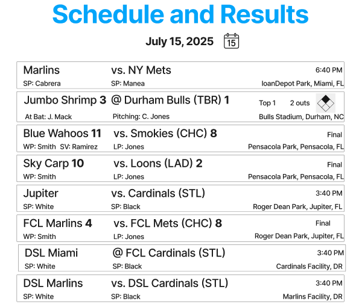

# Miami Marlins Project

## Project Description

The Miami Marlins Baseball Applications team has been tasked with building an application where any member of the organization can get a quick glance of the schedule or results for all of the team’s affiliates for a given date on the calendar. To support this functionality, the team has determined it needs to build a web application that displays summaries of each of the affiliates games for a given day in the 2026 season.

### Deliverable

The deliverable should be a runnable web app that can provide a single page that loads the current state of a given day’s schedule for the Miami Marlins and all of the affiliate teams.

### Functional Requirements

- The app should load from a specific URL in the browser.
- By default, the page should show games for today's date.
- The page should provide the user the affordance to select a date for which the games should be shown.
- The submission should include instructions on how to run the project locally on a development machine, including any prerequisites and dependencies that are necessary.

## Tools used:

- Vite, React, and TypeScript.

## How to run

1. git clone <repo>
2. cd Miami-Marlins
3. npm install
4. npm run dev

## How It Works

1. User selects a date on the calendar.
2. The app calls the MLB Stats API.
3. It retrieves:
   - All Marlins affiliate games for that date
   - Game details such as teams, venue, time, and results
4. It cross-references affiliate team IDs to identify which teams are not playing that day.
5. The UI displays both:
   - Scheduled / final games with results
   - "No Game" cards for teams not playing

## Project Image



---

## Prototype Notes

### What This Prototype Is Testing

This build is scoped to validate three things:

1. **Information architecture across game states** — Does a single tile model work for Preview, Live, and Final states, or do the different data shapes force incompatible layouts? The three card components (`UpcomingCard`, `LiveCard`, `FinalCard`) represent a hypothesis that each state warrants its own component rather than a unified card with conditional rendering.

2. **MLB Stats API viability** — Can the public `/schedule` and `/game/{id}/feed/live` endpoints provide all the required fields (probable pitchers, linescore, decisions, runner data) reliably enough to drive the UI? This prototype exercises those endpoints directly so data gaps surface early.

3. **Date navigation UX pattern** — Does a prev/next arrow pattern with a hidden calendar popup reduce friction compared to a full calendar view exposed by default? The `DatePicker` component tests this interaction model.

---

### What's Real vs. Simulated

| Element                            | Status              | Notes                                                                                                                                                                                                        |
| ---------------------------------- | ------------------- | ------------------------------------------------------------------------------------------------------------------------------------------------------------------------------------------------------------ |
| Schedule data                      | **Real**            | Live fetch from `statsapi.mlb.com/api/v1/schedule`                                                                                                                                                           |
| Game detail data (Preview / Final) | **Real**            | Live fetch from `statsapi.mlb.com/api/v1.1/game/{id}/feed/live`                                                                                                                                              |
| Live in-progress game data         | **Simulated**       | `Data/games/900001.json` and `900002.json` are mock payloads. The real API rarely returns a live-state game during off-season or low-activity dates, so mock data was used to validate the Live card layout. |
| Team list                          | **Hardcoded**       | Affiliate `teamId` list in `useMlbStats.ts` is static — not fetched dynamically.                                                                                                                             |
| Auto-refresh                       | **Not implemented** | The spec explicitly excluded it; data updates only on manual browser refresh.                                                                                                                                |

To toggle mock live games back on, uncomment lines 40–42 in [`src/hooks/useMlbStats.ts`](src/hooks/useMlbStats.ts):

```ts
const mockGames = (mockData.dates[0]?.games || []).map((g: any) => ({
  ...g,
  _mock: true,
}));

const allGames = [...mockGames, ...realGames];
```

---

### Known Limitations

- **Minor league pitcher data is sparse.** The API frequently omits `probablePitchers` for lower-level affiliates. The UI falls back to "n/a" but does not distinguish "not yet announced" from "not available."
- **Runner names on Live card.** The runner list renders all runners in `currentPlay.runners`, which includes runners who have already scored or been put out in the current play. A production version would filter to only runners currently on base.
- **Opponent's MLB parent club is not shown.** The spec calls for displaying the opponent's MLB parent organization (e.g., "Mets" for a St. Lucie Mets game). The API provides this via `parentOrgName` on team objects, but it is not yet surfaced in the UI.
- **No error state UI.** API failures are caught and logged to the console but the user sees a blank page. A production build would need an error boundary and retry logic.
- **TypeScript types are loose.** API response shapes are typed as `any` throughout. Hardening these to typed interfaces would be a prerequisite for production.

---

### Open Questions for the Team

1. **Refresh cadence** — The spec says no auto-refresh, but live games change rapidly. Is a manual refresh acceptable long-term, or should the Live card poll on an interval (e.g., every 30 seconds)?
2. **Affiliate team list ownership** — Should the affiliate `teamId` list be maintained in the front end, or fetched from an internal API so roster changes (promotions, new affiliates) don't require a code deploy?
3. **Game level display** — The spec asks for the level of play (e.g., "1A", "AAA"). The schedule API returns `sport.name` (e.g., "Triple-A East") but not a short code. Does the team have a mapping, or should the full sport name be displayed?
4. **Authentication** — The current prototype uses the public MLB Stats API with no auth. Will the production app need to proxy through an internal service or use authenticated endpoints for any data?
5. **Mobile layout** — The current grid layout assumes a wide viewport. Has the team defined breakpoints or a mobile-first requirement for this tool?
